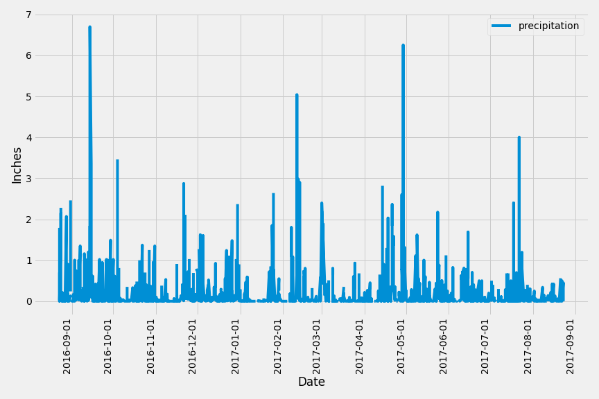
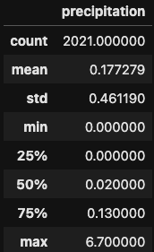
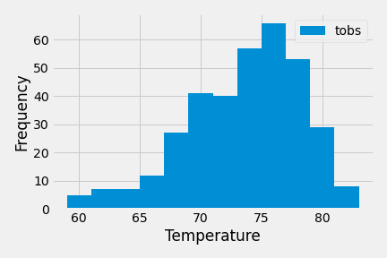

# sqlalchemy-challenge

## Description
This challenge consist of exploring and analyzing climate data in Hawaii to help plan for future trips.

## How to Run Code
Clone this repository, open the Jupyter notebook to run queries for the precipitation and station analysis, and the python app file to run the climate app via Flask.

## Results
Below is the plot of precipitation over time (between 8/23/16 - 8/23/17):

Here is a summary of the data subset that was used for the plot above:

Below is the histogram of observed temperature in the most active station:
